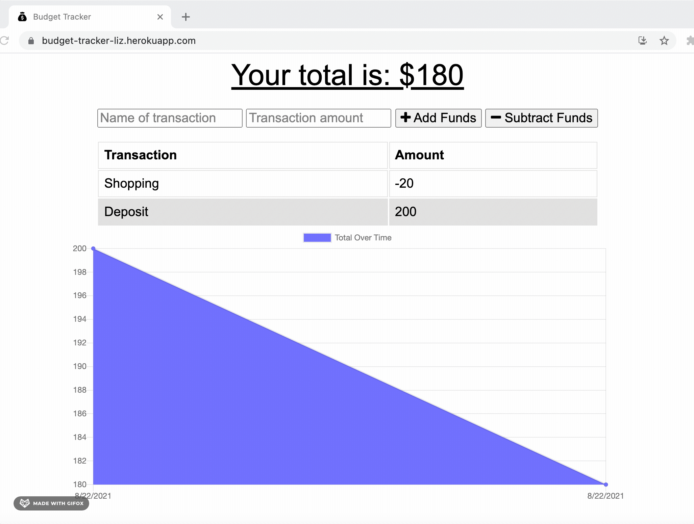
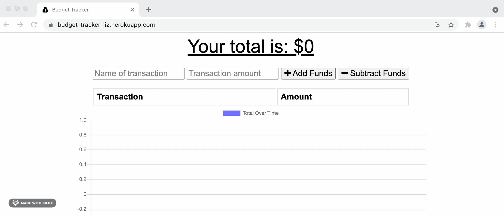

# BUDGET TRACKER

## Description
A Progressive Web Application that allows users to add expenses and deposits to their budget even if they are offline.

  ## Table of Contents

* [Installation](#installation)
* [Deployment](#deployment)
* [License](#license)
* [Functionality](#functionality)
* [Questions](#questions)

## Installation 
Clone the repo, run `npm i` to install the dependencies. 

To start the application, run:
`npm start`. 

## Deployment
You can see the deployed Application [here](https://budget-tracker-liz.herokuapp.com/).

## License

## Functionality

This application works even if you are offline and you can install the app here:

## Questions
If you have any questions about this project, send me an email at lizethariasc14@gmail.com or contact me through my [GitHub](https://github.com/lizariasc).
